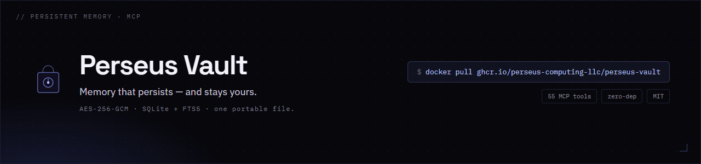

<div align="center">
  
</div>

# Perseus Vault

<!-- mcp-name: io.github.Perseus-Computing-LLC/perseus-vault -->

> **Persistent, encrypted memory for AI agents. One Rust binary, one file, no cloud.**

[](./LICENSE)
[](https://rust-lang.org)
[](https://github.com/Perseus-Computing-LLC/perseus-vault/releases)
[](integrations/langgraph/)
[](integrations/crewai/)
[](integrations/autogen/)
[]()
[](https://mcpservers.org/servers/perseus-computing-llc/perseus-vault)

Give your agents memory that survives the session, so they stop re-deriving what they
already learned and stop repeating past mistakes. Hybrid recall (BM25 + dense + RRF),
bi-temporal history, and **AES-256-GCM** at rest, exposed as **55+ MCP tools** that work
with any host. **73.8% on LongMemEval's official harness** (vs Zep 63.8%, Mem0 49.0%).
**One binary. One file. No Docker. No Postgres. No cloud.** Local-first, air-gap ready, MIT.

## One-Line Install

```bash
curl -sSf https://raw.githubusercontent.com/Perseus-Computing-LLC/perseus-vault/main/scripts/install.sh | sh
```

That's it. Perseus Vault is installed to `~/.local/bin/perseus-vault`. Start it:

```bash
perseus-vault serve --db ~/.mimir/data/perseus-vault.db
```

> **macOS note (Apple Silicon).** A freshly built or copied binary is
> SIGKILLed on first run (`Killed: 9`, no other output) by the OS binary
> policy — even with no quarantine attribute. The one-line installer and the
> `bootstrap.sh` build-from-source installer ad-hoc code-sign Perseus Vault for
> you. If you build the binary yourself, sign it once **after each rebuild**:
>
> ```bash
> cargo build --release
> cp target/release/perseus-vault ~/.local/bin/perseus-vault
> codesign --force --sign - ~/.local/bin/perseus-vault   # required on Apple Silicon; fixes "Killed: 9"
> ```
>
> `--force` re-signs an already-signed binary (needed after every rebuild); the
> step is harmless on Intel macOS and unnecessary on Linux/Windows.

Then wire your MCP client(s) — and the full recall/capture loop — in one command:

```bash
perseus-vault install-client --hooks --rules
```

This autodetects Claude Code / Codex / Cursor (pass `--client <name>` for
claude-desktop, hermes, windsurf, vscode, zed, or generic; `--all-detected`
wires every detected client), merges the MCP server registration into the
client's config without clobbering anything (a `.bak-perseus` backup is
written first), points every client at **one shared memory database**,
registers the session lifecycle hooks (recall injection on SessionStart,
hygiene on session end — the `docs/lifecycle-hooks.md` contract), and appends
the memory usage rules to `CLAUDE.md`/`AGENTS.md`. Re-running is a no-op; add
`--dry-run` to preview every file it would touch.

Or connect any MCP host by hand (Claude Desktop, Cursor, Hermes Agent, Perseus, etc.):

```json
{
  "mcpServers": {
    "perseus-vault": {
      "command": "perseus-vault",
      "args": ["serve", "--db", "~/.mimir/data/perseus-vault.db"]
    }
  }
}
```

## 30-Second Quickstart

```bash
# Start Perseus Vault
perseus-vault serve --db memory.db &
sleep 1

# Remember a fact (via MCP JSON-RPC on stdio)
echo '{"jsonrpc":"2.0","id":1,"method":"tools/call","params":{"name":"mimir_remember","arguments":{"category":"demo","key":"hello","body_json":"{\"text\":\"Hello from Perseus Vault!\"}"}}}' | perseus-vault serve --db memory.db

# Search for it
echo '{"jsonrpc":"2.0","id":2,"method":"tools/call","params":{"name":"mimir_recall","arguments":{"query":"Hello"}}}' | perseus-vault serve --db memory.db
```

## Works With Every MCP Client

Perseus Vault is a standard MCP **stdio** server — the same `perseus-vault serve` command works
everywhere. Run `perseus-vault doctor` to validate your install and print this matrix locally.

| Client | Status | Config | 
|---|---|---|
| Claude Desktop | ✅ | `claude_desktop_config.json` |
| Claude Code / Hermes | ✅ | `.mcp.json` / `config.yaml` |
| Cursor | ✅ | `.cursor/mcp.json` |
| Windsurf | ✅ | `mcp_config.json` |
| VS Code + Continue.dev | ✅ | `config.json` |
| Zed | ✅ | `settings.json` |
| Codex CLI | ✅ | `~/.codex/config.toml` |

Copy-paste config snippets for each: **[docs/clients/](docs/clients/)**.

Then wire the **recall → work → capture → consolidate** loop to your client's
session events (SessionStart/Stop hooks for Claude Code, Codex, and Cursor,
plus a portable AGENTS.md fallback): **[docs/lifecycle-hooks.md](docs/lifecycle-hooks.md)**.

## Why Perseus Vault

Perseus Vault is the **only** memory engine that is simultaneously MCP-native,
local-first, zero-dependency, AND agent-first.

### LongMemEval QA (official harness)

Recall quality measured on LongMemEval's **official** harness, not a home-grown script:

| Memory engine | QA accuracy |
|---|---|
| **Perseus Vault** | **73.8%** |
| Zep | 63.8% (published) |
| Mem0 | 49.0% (published) |

`longmemeval_s` (500 questions), gpt-4o-2024-08-06 answerer + LongMemEval's official judge; competitor numbers are their published values. Perseus Vault's 73.8% is the plain mean of 3 runs; 79.0% with official CoT. [Methodology & signed results →](benchmark/longmemeval/COMPARISON.md)

### Bi-temporal time-travel (three-axis)

Our strongest structural differentiator — full **SQL:2011 bi-temporal** history
(transaction-time *and* valid-time) — measured against a reproducible,
**fully offline** gauntlet. It drives the real shipped binary over MCP stdio
through the hard cases single-axis competitors get wrong (retroactive
corrections, proactive future-dated facts, out-of-order arrival, belief-vs-truth
divergence, closed periods):

| Axis | Question it answers | Checks | Pass |
|---|---|---|---|
| **valid-time** (`valid_at`) | "what was true in the world at T" | 10 | 10 |
| **transaction-time** (`as_of`) | "what did we believe at T" | 1 | 1 |
| **bi-temporal** (`bitemporal`) | "as of belief at T, what was true at V" | 2 | 2 |
| **Total** | | **13** | **13 (100%)** |

Reproduce with a single command (no API key, no network, no LLM):

```bash
cargo build --release
python benchmark/temporal/gauntlet.py --bin target/release/perseus-vault
```

The PASS/FAIL verdicts are deterministic (wall-clock timestamps vary, verdicts
do not), so a correct build re-runs to an identical `signature_sha256`. The
committed [`gauntlet_report.json`](benchmark/temporal/gauntlet_report.json) is
the reference. [Methodology & dataset →](benchmark/temporal/README.md)

### Comparison Matrix

| | Perseus Vault | Mem0 | Letta | Zep |
|---|---|---|---|---|
| **Deployment** | Single binary | Cloud + self-host | Docker/Postgres | Docker/Neo4j |
| **Dependencies** | None (SQLite embedded) | Python + vector DB | Postgres + Python | Neo4j + Go (Graphiti) |
| **MCP-Native** | ✅ 55+ tools | ❌ Not MCP-native | ❌ Not MCP-native | ❌ Not MCP-native |
| **Offline/Local** | ✅ Fully local | Cloud-dependent | Docker needed | Docker needed |
| **Encryption** | AES-256-GCM ✅ | ❌ | ❌ | ❌ |
| **Hybrid Search** | BM25 + Dense + RRF | Vector only | Vector only | Vector + Graph |
| **Entity Lifecycle** | Decay + Promote + Archive | ❌ | ❌ | ❌ |
| **Entity Graph** | Link + Traverse | ❌ | ❌ | ✅ |
| **Journal Audit Trail** | ✅ Immutable | ❌ | ❌ | ❌ |
| **State Management** | ✅ Key-value + TTL | ❌ | ❌ | ❌ |
| **MCP Tools** | 55+ | 5 | 8 | 0 |
| **License** | MIT | Apache 2.0 | Apache 2.0 | Apache 2.0 |

[Full comparison: Perseus Vault vs Mem0 →](docs/comparison/mimir-vs-mem0.md)
[vs Letta →](docs/comparison/mimir-vs-letta.md)
[vs Zep →](docs/comparison/mimir-vs-zep.md)

### Stress Test: 100K Entities

Perseus Vault handles production workloads on modest hardware:

| Metric | Result |
|---|---|
| **100K entity insert** | 1.01s (98,732 entities/s) |
| **FTS5 recall (10 results)** | 0.022s |
| **Decay tick (100K entities)** | 1.317s (batched, transactional) |
| **Memory (100K entities)** | ~85MB RSS |
| **DB file size (100K)** | ~45MB (with FTS5 index) |

Run it yourself: `cargo test stress_100k --release -- --ignored --nocapture`

### Recall Accuracy at Scale: Keyword Collapses, Hybrid Holds

Speed is table stakes — the question that matters for agent memory is *does the
right memory actually surface?* Measured on distinct-content corpora (first-party,
reproducible; see [`benchmark/lambda/`](benchmark/lambda/)), recall@k by mode:

**100,000 entities** (1×H100, `nomic-embed-text` on Ollama):

| recall@k | keyword (BM25/FTS5) | dense | **hybrid (RRF)** |
|---|---|---|---|
| @1 | 0.003 | 0.680 | **0.785** |
| @5 | 0.015 | 0.859 | **1.000** |
| @10 | 0.029 | 0.899 | **1.000** |

At 100K entities, hybrid recall is **perfect @5 while keyword search lands ~1.5%
of the time** — a **~66× gap**. And it *widens* with scale: at 10K entities keyword
recall@5 was 0.008 while hybrid was already 1.000; keyword-only memory silently
degrades as an agent accumulates history, hybrid (BM25 + dense + reciprocal-rank
fusion) does not. This is the core argument for Perseus Vault's hybrid retrieval.

**Head-to-head, same box, same corpus, all fully local** (1×H100, Ollama —
identical fact set, queries, and substring judge for every system):

| System | Recall accuracy | p50 latency | Notes |
|---|---|---|---|
| **Perseus Vault** (hybrid) | **1.00** | 35.6 ms | single self-contained binary, in-process |
| Letta (archival / pgvector) | 1.00 | 135.5 ms | server + Postgres/pgvector |
| Mem0 (vector) | 0.60 | 37.9 ms | Python + vector DB |
| Zep (Graphiti temporal KG) | 0.20 | 49.7 ms | server + Neo4j; graph extracted by local model |

Every competitor was **stood up and run live** on the same box against the same
local Ollama (`qwen2.5:14b-instruct` + `nomic-embed-text`) — no cloud, no fabricated
numbers. Letta ran as the `letta/letta` server (bundled Postgres/pgvector) and matched
Perseus Vault at 1.00. Zep's self-hosted Community Edition server is deprecated and its
`zep_python` memory API is now Zep Cloud-only, so we measured Zep's actual OSS engine —
Graphiti temporal KG on Neo4j — with entity/edge extraction *and* embeddings on the same
local Ollama. Its 0.20 reflects the honest cost of building a knowledge graph with a
**local** model (structured extraction is lossy: 5 entities / 2 edges from 6 facts) — not
Zep Cloud, which uses frontier models. Full artifact + methodology:
[`benchmark/lambda/results/competitors.json`](benchmark/lambda/results/competitors.json).

**Cold-start:** a bare GPU box reaches its **first grounded RAG answer in 3.3s**
(models staged on disk).

Reproduce: [`benchmark/lambda/scale_bench.py`](benchmark/lambda/scale_bench.py) and
[`competitors_bench.py`](benchmark/lambda/competitors_bench.py).

Deploying beside a model server on a GPU host (vLLM on MI300X/H100)? See the
[AMD MI300X deployment reference](docs/deployment-amd-mi300x.md) — measured
co-residency numbers plus the `/dev/shm`, PID-1, and version-pinning gotchas
that break these stacks in practice.

## Framework Integrations

Ready-to-use adapters that make Perseus Vault the default memory backend for
popular AI agent frameworks:

| Framework | Integration | Type |
|---|---|---|
| [**LangGraph**](integrations/langgraph/) | `MimirStore` | `BaseStore` implementation |
| [**CrewAI**](integrations/crewai/) | `MimirMemoryTool` | Agent tool |
| [**AutoGen**](integrations/autogen/) | `MimirMemory` | `Memory` implementation |

Each adapter:
- Connects via MCP stdio subprocess (persistent session)
- Maps the framework's memory interface to Perseus Vault tools
- Comes with a README quickstart (5 minutes to working)
- Has passing tests with mocked MCP transport

Any MCP-compatible framework works with Perseus Vault directly. See
[Awesome Mimir](awesome-mimir.md) for the full list.

## 55+ MCP Tools

> **Tool names & the `perseus_vault_` prefix.** The tables below use the
> historical `mimir_*` names, but by default the server now advertises each tool
> **once**, under its canonical `perseus_vault_*` name (e.g. `perseus_vault_remember`).
> The legacy `mimir_*` and `mneme_*` names remain fully *callable* — every prefix
> dispatches to the same handler — they are just no longer advertised in
> `tools/list`. This keeps the advertised manifest to one name per tool instead
> of tripling it (3× alias bloat), so connected clients don't reload a tripled
> tool-schema payload on every request. To restore the historical behaviour of advertising all three
> prefixes, set `PERSEUS_VAULT_TOOL_ALIASES=all` (the legacy env
> `MIMIR_TOOL_ALIASES` is also honoured; `PERSEUS_VAULT_` takes precedence).
>
> **Client compatibility (#633).** Clients that *gate on the advertised list* —
> they check `tools/list` before calling and skip tools they don't see — will
> silently skip legacy `mimir_*` calls against a 2.x vault even though the call
> itself would succeed. Known case: the `perseus` CLI **≤ 1.0.22** hard-codes
> `mimir_recall` and degrades to empty local-only recall. Fix either side:
> upgrade the CLI to **≥ 1.0.23** (calls canonical names, with dynamic
> fallback), or set `PERSEUS_VAULT_TOOL_ALIASES=all` on the vault as a bridge
> while older clients remain deployed.

### Entity CRUD
| Tool | Description |
|---|---|
| `mimir_remember` | Store/update entity. Idempotent by (category, key); a content change snapshots the prior version into history. |
| `mimir_recall` | Search with FTS5/dense/hybrid modes, filters, stemming expansion. Query contract (#562): `query=""` is match-all enumeration (the "list all" path); `"*"` and other wildcards are literal FTS5 terms, **not** globs — `"*"` matches nothing. |
| `mimir_scan` | Deterministic paginated enumeration of a category or the whole store (#562): immutable `id ASC` keyset pages with a `next_cursor`/`has_more` contract, so export/sync/reset callers can walk every entity exactly once. Read-only — no retrieval-count/decay side-effects, no offset cap. |
| `mimir_recall_layer` | Recall from a specific biomimetic layer (world, episodic, semantic). |
| `mimir_recall_when` | Proactive just-in-time recall: surface entities whose `recall_when` triggers match. |
| `mimir_get_entity` | Fetch one entity by ID with full `body_json`. |
| `mimir_as_of` | Transaction-time time-travel: the version of a fact (category + key) that was *believed* at a past instant. |
| `mimir_valid_at` | Valid-time lookup: the version that was *actually true in the world* at an instant, per current knowledge (SQL:2011 APPLICATION_TIME). |
| `mimir_bitemporal` | Full 2-axis bi-temporal query: "as of transaction time T, what did we believe was true at valid time V" — the exact rectangle cell. |
| `mimir_history` | List superseded versions of a fact (category + key), newest first — paginated (`limit` default 20, plus `offset`); `total` reports the full trail size (companion to `mimir_as_of`). |
| `mimir_forget` | Soft-delete (archived=1). |

### Search & RAG
| Tool | Description |
|---|---|
| `mimir_ask` | RAG: recall context, query LLM, return grounded answer with sources. |
| `mimir_embed` | Generate dense vectors via the bundled model, Ollama, or OpenAI-compatible endpoint. |
| `mimir_semantic_search` | Dense-only semantic search shortcut — find entities by meaning, ranked purely by embedding similarity (no keyword fallback). |
| `mimir_context` | Pre-formatted markdown block for session injection. Recall-first by default: pass `query` (the current task/message) and only topically relevant entities are injected, clamped to a per-model budget; the legacy unconditional dump requires `mode: "always_inject"`. |
| `mimir_ingest` | Trigger connector syncs (GitHub, file watcher). |
| `mimir_ingest_file` | Locally extract a document's text (plaintext/markdown always; DOCX/PDF with the `multimodal` feature) and store it as a recallable entity. |
| `mimir_extract` | Local, deterministic, rule-based knowledge extraction (facts / preferences / temporal events / episodes) from text or a stored entity. Read-only. |
| `mimir_capture` | Opt-in in-session capture (#520): distill a transcript/insight payload (text, markdown, or JSONL) into durable entities (root-cause / pitfall / decision / pattern / takeaway) the moment a problem is solved. Local rule-based distiller by default, optional `llm: true` with graceful fallback; near-dup merging stays ON plus a per-invocation cap (anti-flood). Also a CLI verb: `perseus-vault capture`. |
| `mimir_memories` | Anthropic memory-tool compatible file interface (`view`/`create`/`str_replace`/`insert`/`delete`/`rename` under `/memories`), backed by vault entities. |

> 📖 **[docs/retrieval-modes.md](docs/retrieval-modes.md)** — one enumerated reference for every retrieval mode (keyword · dense · hybrid · graph · GraphRAG · proactive `recall_when` · temporal `as_of`): mechanism, when to use, invocation, and examples.

### Graph
| Tool | Description |
|---|---|
| `mimir_link` | Create typed relationship links between entities. |
| `mimir_unlink` | Remove entity links. |
| `mimir_traverse` | Walk entity link graph up to configurable depth. |
| `mimir_communities` | GraphRAG community detection over the link graph (deterministic label propagation or greedy-modularity "louvain"; pure Rust, offline). |
| `mimir_community_summary` | Extractive (optionally LLM-polished) summary of one community, materialized as an entity with `evidence_for` links to members. |
| `mimir_global_recall` | GraphRAG global search: breadth over community summaries, then depth into the best communities' members — holistic answers across clusters. |

### Journal
| Tool | Description |
|---|---|
| `mimir_journal` | Append structured event with actor attribution. |
| `mimir_check_failure_pattern` | Deja-vu guard: check an action against previously recorded failures (journal + failure/pitfall entities) before retrying it. Read-only. |
| `mimir_timeline` | Query journal by time range with filters. |

### State
| Tool | Description |
|---|---|
| `mimir_state_set` | Set key-value state with optional TTL. |
| `mimir_state_get` | Get state value. Returns null if expired. |
| `mimir_state_delete` | Delete state entry. |
| `mimir_state_list` | List state keys, optionally filtered by prefix. |

### Lifecycle
| Tool | Description |
|---|---|
| `mimir_decay` | Recalculate Ebbinghaus decay scores (batched 1000-entity transactions). |
| `mimir_prune` | Bulk archive by category, decay threshold, or age. |
| `mimir_purge` | Permanently delete archived entities + VACUUM. Destructive. |
| `mimir_cohere` | Autonomous coherence grooming pass — promote, decay, link, archive. |
| `mimir_autocohere` | Full atomic grooming: cohere → decay → compact in one pass (supports dry-run). |
| `mimir_compact` | Archive entities below decay threshold. |
| `mimir_reindex` | Rebuild FTS5 search index from entities table. |
| `mimir_consolidate` | Merge overlapping/duplicative entities in a category into durable, evidence-tracked observations (mirror image of `mimir_conflicts`). |
| `mimir_dream` | Sleep-time LLM consolidation: reflect over clusters of related episodic memories via the configured LLM and write back durable semantic insights, provenance-linked to every source. Idempotent (evidence-set hash), contradiction-aware, bounded; requires `--llm-endpoint`. |

### Quality
| Tool | Description |
|---|---|
| `mimir_score` | Assign quality score (0.0-1.0). |
| `mimir_conflicts` | Detect conflicting entities via trigram similarity; opt-in `resolve=true` invalidates the lower-certainty side into history (reversible, dry-run by default). |
| `mimir_correct` | Structured correction capture for learning from errors. |
| `mimir_supersede` | Mark a new fact as superseding an old one (sets the old entity to `deprecated`). |
| `mimir_follow` | Record whether an entity was actually FOLLOWED or MISSED — follow-rate efficacy signal that feeds decay scoring. |

### Vault & Federation
| Tool | Description |
|---|---|
| `mimir_vault_export` | Export entities to .md files with YAML frontmatter. |
| `mimir_vault_import` | Import from .md vault directory (idempotent). |
| `mimir_federate` | Copy entities between workspaces. |
| `mimir_share` | Share one entity (by category + key) into another workspace, preserving content. |
| `mimir_workspace_list` | List all distinct entity categories. |

### Metrics & Ops
| Tool | Description |
|---|---|
| `mimir_stats` | Full DB statistics across all tables. |
| `mimir_health` | Server and DB health check. |
| `mimir_bench` | Performance benchmark tracking. |
| `mimir_maintenance` | DB maintenance: dedup, orphan detection, VACUUM, FTS5 reindex (supports dry-run). |
| `mimir_synthesize` | LLM session synthesis — extract lessons from transcripts. |
| `mimir_migrate` | Migrate v0.1.x DB to current schema. |

## CLI

```bash
# Server
perseus-vault serve --db /data/perseus-vault.db
perseus-vault serve --web --port 8767 --encryption-key ~/.mimir/secret.key
perseus-vault serve --llm-endpoint http://localhost:11434/api/generate --llm-model llama3
perseus-vault serve --transport sse --port 8787 --mcp-token my-secret-token

# Maintenance (operate directly on DB, no server needed)
perseus-vault stats          --db /data/perseus-vault.db
perseus-vault forget         --db /data/perseus-vault.db --category decision --key stale-choice --reason "superseded"
perseus-vault prune          --db /data/perseus-vault.db --category junk --min-decay 0.1 --dry-run
perseus-vault purge          --db /data/perseus-vault.db --dry-run
perseus-vault decay          --db /data/perseus-vault.db
perseus-vault reindex        --db /data/perseus-vault.db
perseus-vault vault-export   --db /data/perseus-vault.db --vault-dir ./export/
perseus-vault vault-import   --db /data/perseus-vault.db --vault-dir ./export/
perseus-vault obsidian-sync  ~/obsidian-vault/Perseus Vault/          # one-shot export to an Obsidian vault
perseus-vault obsidian-sync  ~/obsidian-vault/Perseus Vault/ --watch  # continuous sync on every memory change

# Key management
perseus-vault keygen --key-file ~/.mimir/secret.key
```

> **Manual DB edits.** The maintenance verbs above and the normal MCP write path
> keep the FTS5 index in sync automatically. Editing the `entities` table
> **directly** with `sqlite3` (a manual `DELETE`/`UPDATE`) bypasses that sync and
> can leave orphaned index rows — "ghost" recall hits for content that is already
> gone. After any direct SQL edit, run `perseus-vault maintain --db <path>` (or
> `perseus-vault reindex`) to reconcile the FTS index.

### Flags

| Flag | Description |
|---|---|
| `--db` | SQLite database path (default: `~/.mimir/data/perseus-vault.db`) |
| `--web` | Start web dashboard |
| `--port` | Dashboard port (default: 8767) |
| `--web-bind` | Dashboard bind address (default: 127.0.0.1) |
| `--transport` | MCP transport: `stdio` (default), `sse`, or `http` |
| `--mcp-token` | Bearer token for SSE/HTTP transport auth |
| `--encryption-key` | AES-256-GCM key file path |
| `--llm-endpoint` | LLM API endpoint for `mimir_ask` and embeddings |
| `--llm-model` | LLM model name (default: llama3) |
| `--llm-api-key` | API key for LLM endpoints (OpenAI, Azure, etc.) |
| `--embedding-endpoint` | OpenAI-compatible embedding endpoint |
| `--connectors-config` | Path to connectors.yaml |

### Database location

The **canonical** database path is:

```
~/.mimir/data/perseus-vault.db
```

Always pass `--db` (or set `$MIMIR_DB_PATH`) in scripts, MCP host configs, and
cron/harvest jobs so every invocation targets the same file. When neither is
set, Perseus Vault resolves the default in this order and uses the **first that
already exists** (so upgraders and legacy single-user installs are picked up
instead of silently starting empty):

1. `~/.mimir/data/perseus-vault.db` — canonical (current name)
2. `~/.mimir/data/mneme.db` — pre-rename
3. `~/.mimir/data/mimir.db` — pre-rename
4. `~/mimir.db` — legacy single-user install location

If none exist, it creates `~/.mimir/data/perseus-vault.db`. If **more than one**
of these exists and you did not pass `--db`/`$MIMIR_DB_PATH`, Perseus Vault
prints a stderr warning naming the chosen file and the others it ignored, so an
ambiguous multi-database state is visible rather than silent. Setting `--db` or
`$MIMIR_DB_PATH` explicitly always wins and suppresses the warning.

## Your AI Memory in Obsidian

Perseus Vault is your AI agent's long-term memory — and it doubles as **your** second
brain. Every entity your agent remembers exports to a plain Markdown note with
YAML frontmatter, so your AI's memory becomes a navigable personal knowledge
base inside the tools you already use: **Obsidian, Logseq, or Notion.**

```bash
# Export your entire memory to an Obsidian vault as linked Markdown notes
perseus-vault obsidian-sync ~/obsidian-vault/Perseus Vault/

# Keep it live — re-export automatically on every memory change
perseus-vault obsidian-sync ~/obsidian-vault/Perseus Vault/ --watch
```

Open the vault in Obsidian and you get a graph of your agent's knowledge.

**WikiLink backlinks.** When one entity links to another (via `mimir_link` or a
`depends_on` / `implements` / `references` relationship), the exported note gets
a `## Links` section with `[[WikiLink]]` backlinks that resolve natively in
Obsidian's graph view:

```markdown
---
id: cli-de8dfb8364b6
category: architecture
key: api
type: insight
decay_score: 0.5000
---

{"content":"axum service"}

## Links

- [[cli-99756b494c7d|database]] (depends_on)
```

Links resolve **by entity id** (notes are written as `<id>.md`) so they never
break, and Obsidian shows the human-readable `key` as the link label. Open the
graph view and your agent's architecture, decisions, and insights become a
clickable knowledge map.

**`--watch`** polls Perseus Vault's cheap, deterministic state digest on an interval and
re-exports only when memory actually changes. It naturally catches every
`mimir_remember` write with no filesystem-watcher dependency and no coupling to
the server. Tune the interval with `MIMIR_SYNC_INTERVAL_SECS` (default: 2s).

### Other PKM tools

| Tool | How |
|---|---|
| **Obsidian** | `perseus-vault obsidian-sync <vault>` — WikiLinks resolve in the graph view out of the box. |
| **Logseq** | Point `obsidian-sync` at your Logseq graph directory. Logseq reads the same `[[WikiLink]]` syntax and Markdown frontmatter. |
| **Notion** | Run `perseus-vault vault-export`, then use Notion's *Import → Markdown & CSV* to pull the notes in. |

Unlike cloud-only "second brain" tools, Perseus Vault runs **100% local**, is written in
**Rust**, encrypts at rest with **AES-256-GCM**, and applies **decay scoring** so
stale memories fade — your knowledge base stays yours and stays fresh.

## Features

### Semantic Search (on by default)
- **Bundled, in-process embeddings** — a quantized all-MiniLM-L6-v2 model
  (384-dim) is compiled into the binary, so dense/semantic search works with
  **zero config and zero network**: no Ollama, no API key, no model download.
  This is the default build (`bundled-embeddings` feature).
- **Auto-embed on write (#271)** — `mimir_remember` embeds each new (or
  content-changed) entity **synchronously** as it is written, using the bundled
  model. Single-entity embedding is deterministic and LRU-cached, so it is cheap
  and adds no background tasks. Embedding failures are non-fatal (logged to
  stderr); the write always succeeds.
- **Hybrid is the default recall mode (#271)** — `mimir_recall(query=...)` with
  no `mode` flag automatically selects **hybrid** (dense + keyword fused via RRF)
  whenever embeddings exist, and transparently falls back to **fts5** keyword
  search when none do. No manual `mimir_embed` step, no flags to remember.
- **`mimir_semantic_search(query, limit)`** — a one-tool shortcut for pure
  dense, meaning-based search (no keyword fallback) when you just want "find
  things like this".
- **Optional alternate embedder** — to use **Ollama** or any OpenAI-compatible
  `/v1/embeddings` endpoint instead of the bundled model, set `--llm-endpoint`
  (and `--embedding-endpoint` / `--llm-api-key` as needed). This is entirely
  optional; the bundled model is used by default.
- Build a lean binary without bundled embeddings via
  `cargo build --no-default-features` — recall then defaults to keyword search
  unless a remote embedder is configured.

### Hybrid Search internals
- **FTS5 keyword search** with LIKE fallback and Porter stemming expansion
- **Dense vector search** via cosine similarity on stored embeddings
- **Reciprocal Rank Fusion (RRF)** — combine keyword + vector results
- **Query expansion** — automatic stemming variants for broader recall
### Memory Lifecycle

Perseus Vault models memory using three biomimetic layers, inspired by human memory pathways:

- **World (Core):** Slow-decaying, global facts about the environment.
- **Episodic (Buffer):** Fast-decaying, session-specific interaction history.
- **Semantic (Working):** Medium-decaying, general knowledge and learned concepts.

You can interact with these layers directly using the `mimir_recall_layer` tool or by specifying the `layer` parameter in `mimir_remember`.

- **Ebbinghaus decay** — memories naturally fade unless retrieved (refresh on access)
- **Layer promotion** — buffer → working → core based on access frequency
- **Automatic archival** — stale entities archive; purge to permanently delete + VACUUM
- **Always-on entities** — pin identity-critical memories for session injection (hard-capped under recall-first; prefer `recall_when` triggers)

### Recall-First Context Injection

The vault is the query layer — it retrieves the few facts a turn needs instead of
handing the host a standing blob to staple into every system prompt.
`mimir_context` and `perseus-vault prepare` are **recall-first by default**:

- **Relevance gating** — pass `query` (the current task/message) and only entities
  whose `recall_when` triggers or indexed content match it are injected. No query,
  no topical injection: the block is a compact retrieval pointer, byte-stable
  across unrelated vault writes (prefix-cache friendly).
- **Per-model recall budget** — output is clamped to a character budget resolved
  from the host model: default/lean profile 1500 chars; large-window ("opus")
  profile 6000 chars; `max_context_chars` overrides both.
- **Capped always-on** — `always_on: true` still works for identity-critical
  facts, but the recall-first set is hard-capped (top 5) and overflow emits a
  warning steering you to `recall_when` triggers.
- **Legacy opt-in** — the old unconditional top-N dump is still available with
  `mode: "always_inject"` (`--legacy-context` for `prepare`), unclamped unless
  you pass a budget.

```bash
perseus-vault prepare --task "deploying the payments service" --model claude-sonnet-4-6
perseus-vault prepare --task "..." --max-context-chars 800     # explicit budget
perseus-vault prepare --task "..." --legacy-context            # old dump, opt-in
```

### RAG & Embeddings
- **`mimir_ask`** — natural language Q&A over stored memories via any LLM (Ollama, OpenAI, etc.)
- **`mimir_embed`** — generate and store dense vectors via Ollama or OpenAI-compatible `/v1/embeddings`
- Supports single-entity and batch-category embedding

### Encryption
- **AES-256-GCM** transparent encryption for entity `body_json`
- Opt-in via `--encryption-key` flag
- `perseus-vault keygen` subcommand for key generation
- FTS5 index stays plaintext for search

### Web Dashboard
- Built-in Axum HTTP server (`perseus-vault serve --web --port 8767`)
- Dark-themed dashboard with search, entity table, vis.js graph, timeline
- Default bind: `127.0.0.1` (use `--web-bind 0.0.0.0` to expose)
- Separate SQLite connection in WAL mode for concurrent reads

### External Connectors
- **GitHub issues connector** — ingest issues/PRs by repo, rate-limit aware
- **File watcher** — scan directories for `.md`/`.txt`/`.json` files with content-hash dedup
- YAML-based connector config via `--connectors-config`

### Multi-Transport
- **stdio** (default) — zero-config, works with any MCP host
- **SSE** — Server-Sent Events for HTTP-based MCP clients
- **HTTP** — REST-style MCP endpoint
- **Bearer token auth** — for SSE/HTTP transports

## Perseus Integration

Perseus Vault is the default memory backend for [Perseus](https://perseus.observer):

```yaml
mimir:
  enabled: true
  transport: "stdio"
  command: ["perseus-vault", "serve", "--db", "~/.mimir/data/perseus-vault.db"]
  timeout_s: 30.0
  merge_strategy: "local_first"
  fallback_to_local: true
  context_categories: ["decision", "architecture", "convention"]
  context_limit: 10
```

## Government & Federal Procurement

Perseus Vault is built for government deployment from the ground up.

| Capability | Status |
|---|---|
| **License** | MIT — no copyleft, no GPL/AGPL |
| **SBOM** | [Published](./docs/SBOM.md) — NTIA minimum elements |
| **Air-gapped** | Fully offline — no telemetry, no API calls, no network by default |
| **Encryption at rest** | AES-256-GCM, transparent, opt-in |
| **Audit trail** | Immutable journal with chain-of-custody |
| **Supply chain** | SLSA attestation in progress |

**For federal buyers:** See [docs/federal-buyers.md](./docs/federal-buyers.md) for
procurement information, compliance status, and deployment models (air-gapped,
on-premises, classified environments).

Perseus Computing LLC is a US-owned small business. SAM.gov registration in progress.
NAICS: 541715, 541511, 541512.

## Privacy Policy

Perseus Vault is a **local-first MCP server** — it runs entirely on your machine.

### Data Collection
- **No data collection.** Perseus Vault does not collect, transmit, or phone home any user data, usage statistics, or telemetry.
- All data remains in your local SQLite database file.

### Data Usage & Storage
- All memory entities, journal entries, and state are stored locally in a SQLite database at the path you specify via `--db`.
- Optional **AES-256-GCM encryption at rest** is available — when enabled, entity bodies are encrypted before storage.
- No data is shared with Perseus Computing LLC or any third party.

### Third-Party Sharing
- **None.** Perseus Vault is fully air-gapped by default. No API calls, no cloud services, no external network requests.
- The optional dense vector embeddings feature uses a locally-compiled model — no external embedding API is called.

### Data Retention
- You control retention: entities can be soft-deleted (`mimir_forget`), archived (via decay/compact), or permanently purged (`mimir_purge`).
- No automatic off-machine backup is performed.

### Contact
- **Email:** privacy@perseus.observer
- **GitHub:** [Perseus-Computing-LLC/perseus-vault](https://github.com/Perseus-Computing-LLC/perseus-vault)

## License

MIT — see [LICENSE](./LICENSE).
